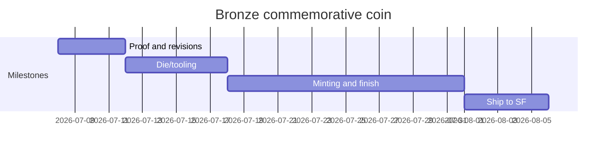
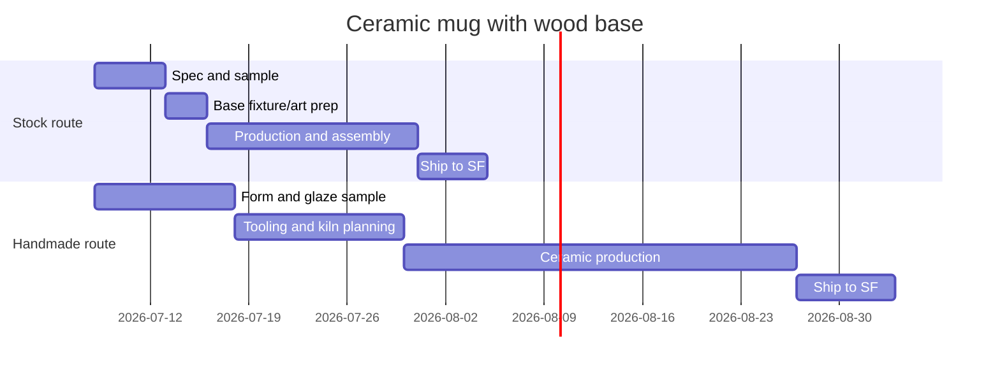
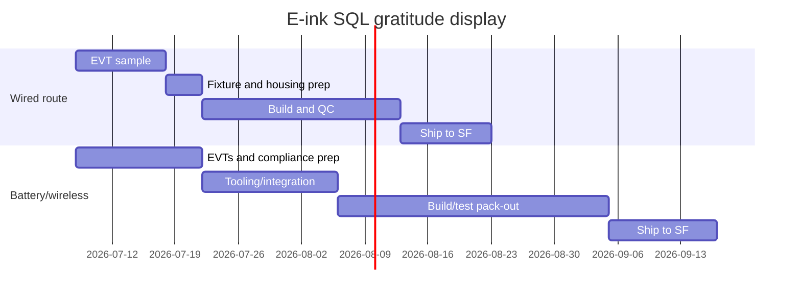
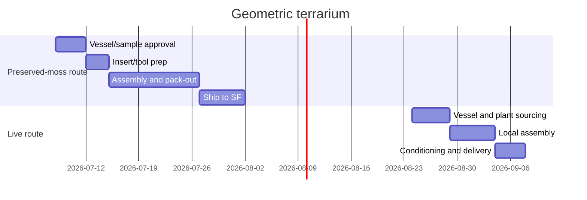
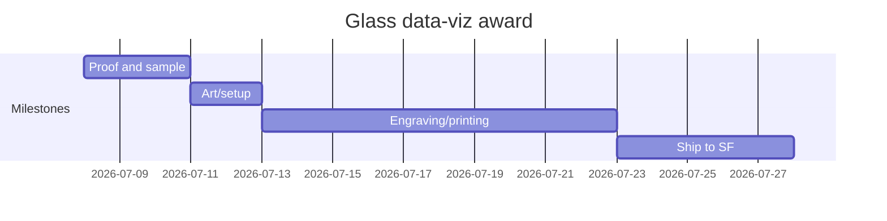
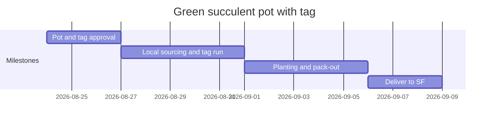
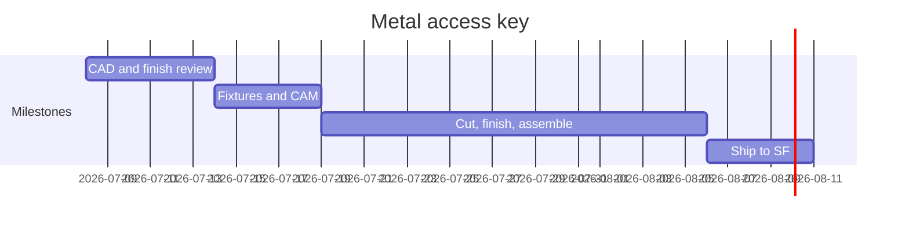
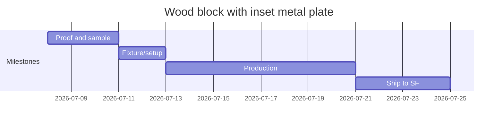

# Supabase Select 2026 award and gift manufacturing assessment

## Executive summary

You have enough time to manufacture **some** of these concepts well for **100 units delivered by mid-September 2026**, but not all of them at the finish level shown in the renders. The safest concepts are the ones that can ride on **stock blanks or standard components with custom engraving/printing/local assembly**: the **wood block with inset metal plate**, **database schema plaque**, **glass data-viz award**, **bronze commemorative coin**, and a **California-assembled succulent pot with tag**. Those all fit comfortably inside a two- to five-week manufacturing window using U.S. suppliers or U.S.-stocked distributors, and they avoid the heaviest customs and breakage risk. Challenge coins, for example, are routinely quoted at **2–5 weeks** after proof approval, with catalog pricing around **$3–$5 each at 100** before premium packaging and up-spec finishing; stock glass award catalogs and stock plaque shops are similarly fast. citeturn22view0turn21view0turn7search0turn19view0turn13search0

The risky concepts are the ones that behave more like **new product development** than custom decoration: the **battery/wireless e-ink device**, the **handmade premium mug route**, and any **live terrarium** that must survive freight and look perfect on arrival. The wired e-ink version is possible only if you use an off-the-shelf 7.5-inch module in a very simple enclosure and avoid batteries, wireless radios, and app/software scope. Once you add batteries and a higher-polish electronics package, the project drifts into regulatory, firmware, assembly, and shipping territory that is not a good fit for a 10–11 week window. citeturn24view0turn24view2turn24view1turn15search6turn15search0

For procurement, I would separate these into tiers. **Best overall premium sponsor award:** glass data-viz award or metal access key. **Best overall partner gift:** wood block metal plate, bronze coin, or database schema plaque. **Best living/eco gift:** succulent pot, but only if assembled in California. **Most visually cool but operationally fragile:** preserved-moss terrarium. **Do not choose unless this is a small VIP run or you want a hero prototype instead of 100 finished pieces:** battery/wireless e-ink display. Current 2026 risk is less about COVID-specific shutdowns and more about **tariff uncertainty, front-loaded imports, rising freight costs, and Middle East-linked shipping disruption**; that makes domestic or U.S.-stocked routing materially safer for this event. citeturn27search0turn27news35turn27search10turn26view2

A note on scope: the chat provided **10 accessible image files**, with the mug shown twice. To give you the **12 decision lines** you asked for, I split three concepts into route variants where manufacturability changes materially: **stock mug vs. handmade mug**, **wired e-ink vs. battery/wireless e-ink**, and **preserved terrarium vs. live terrarium**.

## CSV output

[Download the exact CSV](sandbox:/mnt/data/supabase_select_award_assessment_exact.csv)

```csv
id,name,description,materials,dimensions_assumed,manufacturing_methods,prototype_time_days,tooling_time_days,production_time_days,shipping_time_days,total_lead_time_days,est_tooling_cost_usd,est_unit_cost_usd,est_total_cost_100_usd,packaging_notes,supplier_suggested,cautions
bronze_commemorative_coin,Bronze commemorative coin,"Coin/medallion concept showing Supabase lightning mark and venue reverse; exact diameter/thickness unspecified. Assumed 2.0–2.25 in dia, 3–4 mm thick, antique bronze finish, optional edge text, acrylic capsule or velvet pouch.",Primary metal unspecified; recommended brass or zinc alloy base with antique bronze/copper plating; optional hard enamel fill; packaging acrylic capsule or velvet pouch.,"Unspecified; assumed 50–57 mm diameter, 3–4 mm thick.",Die-struck or die-cast challenge coin; antique plating; optional hard-enamel or no-color recessed relief; laser edge engraving for edition numbering.,4,6,14,5,29,220,10.8,1080,Coin capsule or archival PVC sleeve for lowest cost; velvet pouch or two-piece presentation box adds ~$1.50–$4.00 each.,"US: Osborne Coinage, Signature Coins; China: GS-JJ / challenge-coin OEMs; Europe: Winmedal.","Highly practical. Confirm trademark use for Supabase logo/venue art. 3D sculpted relief or cut-outs add days and die cost. If imported direct, duties/taxes/fees now apply to low-value shipments and China-origin trade rules remain volatile."
ceramic_mug_wood_base_stock,Ceramic mug with wood base – stock-blank route,"Desk gift mug with matte dark body, green interior, embossed logo, and walnut/oak base with metal badge. Exact clay body and dimensions unspecified; modeled as premium stock ceramic mug plus custom wood pedestal/base.","Ceramic mug body (stock blank), wood base/coaster in walnut/oak, brushed stainless/aluminum badge, food-safe glaze/decoration.",Unspecified; assumed 12–14 oz mug about 4.2 in H x 5.2 in L on a 4.5–5.5 in dia wood base.,Buy stock ceramic mug with wood lid/coaster or matte mug blank; laser decorate mug or use embossed blank; CNC/lathe or routed wood base; laser-marked metal badge; final assembly.,5,3,15,5,28,90,27.5,2750,Single-wall retail carton is insufficient; use die-cut EPS/EPE or molded pulp inserts and drop-test because mug + wood base can separate in transit.,US: DiscountMugs/Bagmasters blanks plus local wood CNC shop; China: Global Sources ceramic mug OEMs; Europe: studio pottery/wholesale ceramic houses.,Practical only if based on an existing mug geometry. Exact hand-thrown silhouette and embossed logo may require custom ceramic tooling. Dishwasher-safe logo methods are preferable; glued base should not contact washing.
ceramic_mug_wood_base_handmade,Ceramic mug with wood base – handmade premium route,"Same visual concept, but executed as studio-style stoneware with custom clay body, bespoke mold/hand-finishing, and walnut pedestal. Intended if the tactile premium pottery look is non-negotiable.",Stoneware/ceramic body with matte exterior and glossy interior glaze; walnut/oak pedestal; stainless/brass badge.,"Unspecified; assumed 12–16 oz mug, 3.5–4.5 in tall, wood pedestal 4.5–5.5 in dia.",Slip-cast or jiggered custom ceramic form or small-batch studio pottery; bisque + glaze + kiln firing; wood pedestal turned/CNC’d; engraved badge.,10,12,28,7,57,1200,49.0,4900,Double-protection mandatory: foam around mug lip/handle plus separate base cavity. Expect higher breakage allowance versus the stock-blank route.,US: custom ceramic studios / contract potteries via Thomasnet-style sourcing; China: pottery OEMs via Global Sources/Alibaba; Europe: artisan stoneware houses.,"Borderline for the schedule. Glaze variation, kiln breakage, and handle warpage are real risks at 100 units. Best avoided unless you accept higher variance and start immediately."
database_schema_plaque,Database schema plaque,Stone/concrete/ceramic-style square plaque engraved or printed with a relational schema diagram and event line text. Stand appears separate; exact plaque material unspecified.,"Material unspecified; recommended black granite plaque, ceramic tile, sintered stone, or cast mineral-resin/concrete slab; steel/aluminum stand with rubber feet.",Unspecified; assumed 6–7.5 in square x 0.4–0.75 in thick.,"Fastest path is stock stone or ceramic plaque blank with laser engraving, sandblast, chemical etch, or UV print; optional paint fill; off-the-shelf metal/book stand.",4,2,10,5,21,60,31.0,3100,Use foam sleeve plus corner protection; add anti-scuff tissue because matte stone surfaces show abrasion and chipping on edges.,"US: Hedberg Home custom engraving, PlaqueMaker, local stone engravers; China: stone/coaster UV-print OEMs; Europe: local stone fabricators/trophy houses.","Very practical if treated as a plaque, not as a custom cast-stone sculpture. Fine diagram lines may fill in on rough concrete; polished granite or ceramic gives better legibility."
e_ink_sql_gratitude_wired,E-ink SQL gratitude display – wired desk display,"7.5 in class e-paper desk display in custom housing showing static message/SQL phrase. Assessed as a wired, no-battery, no-wireless product using off-the-shelf display modules.","E-paper module, controller PCB/MCU, 3D-printed or CNC plastic housing, acrylic cover lens optional, USB-C power cable, weighted stand/base.",Unspecified; assumed around 7.5 in display with 170.2 x 111.2 mm outline and overall product roughly 8–9 in H.,"Use stock 7.5 in Waveshare/Seeed panel, simple controller, wired USB-C power, 3D-printed/SLS/SLA or CNC ABS/PC enclosure, local final assembly and QC.",10,4,22,10,46,650,149.0,14900,"Antistatic bag for electronics, foam-block product support, cable separated from screen face, avoid pressure on e-paper panel during pack-out.","China: Waveshare, Seeed Studio, JLCPCB; US: Protolabs/local 3D-print bureau for enclosure and fixture; Europe: Ynvisible for alternative e-paper tech.","Only moderately practical. Keep it wired and offline to avoid battery hazmat, FCC/EMC complexity, and app/software risk. Still requires burn-in, firmware lock, and careful screen handling."
e_ink_sql_gratitude_wireless_battery,E-ink SQL gratitude display – battery/wireless smart terminal,The same concept executed as a polished battery-powered smart desk terminal with custom firmware and sealed housing.,"E-paper module, battery pack, charging circuit, enclosure, PCB, buttons/LEDs, cable and retail packaging.",Unspecified; assumed 7.5 in class screen in 8–9 in housing.,"Custom electronics, charging subsystem, battery integration, enclosure tooling or premium print/CNC, firmware and regulatory verification.",14,15,30,12,71,2800,205.0,20500,Battery labeling and protective pack-out required; more test steps and more failure points than the wired version.,China: Waveshare/Seeed/JLCPCB plus battery assembler; US: Protolabs or contract manufacturer for enclosure and final QA; Europe: specialist embedded-product CM.,"Not recommended on this schedule. Adds FCC authorization exposure for electronics, lithium-battery air-shipping constraints, more customs risk, and significantly more QA burden."
geometric_terrarium_preserved,Geometric terrarium – preserved-moss assembly,Brass/black framed polyhedral glass terrarium with moss and a Supabase logo insert. Treated as an assembly gift based on stock terrarium vessels and preserved botanical filler.,"Glass panes with metal frame, preserved moss or faux moss, acrylic/resin logo insert, felt feet, optional gift sleeve.",Unspecified; assumed stock pyramid/raised terrarium about 6 x 6 x 8 in.,Procure stock terrariums; laser-cut or cast logo insert; assemble locally with preserved moss/filler; no live plant/soil.,4,3,12,6,25,150,55.0,5500,"Double-boxing recommended, corner blocks mandatory, fragile label only as secondary control. Add spare overage because glass breakage is likely.",US/CA: WGV International plus local laser-cut shop; China: geometric terrarium OEMs; Europe: handmade stained-glass shops.,Practical if assembled from stocked terrariums. Preserved moss is easier than live plants and avoids agricultural restrictions. Breakage rate and pack-out labor are the main schedule risks.
geometric_terrarium_live,Geometric terrarium – live-plant version,"Same terrarium concept, but using living moss/succulents or planted media for a true biophilic gift.","Glass terrarium, metal frame, live plant material, soil/substrate or hydro media, logo insert/tag.",Unspecified; assumed stock terrarium about 6 x 6 x 8 in.,Local terrarium assembly using live botanicals and stock vessels; preferably done in California near the event.,5,2,14,4,25,100,69.0,6900,"Ventilated pack-out, moisture control, no long dwell in hot freight, deliver as late as possible before the event.",CA-local: event florist/plant studio + WGV or similar vessel supplier; US: The Succulent Source / Lula's Garden for corporate plants; Europe/China not advised for live plants.,"Manufacturable, but operationally riskier. California plant-entry rules can require permits/health documentation; live product losses and appearance variance are material risks."
glass_data_viz_award,Glass data-viz award,Clear optical-glass or jade-glass upright award carrying an abstract data-visualization graphic and a black base with metal plate. Exact glass grade and dimensions unspecified.,"Optical glass, jade glass, or acrylic alternative; black base in glass/stone/wood/metal; stainless/aluminum nameplate.","Unspecified; assumed 6–8 in tall, 4–5 in wide, 0.5–0.75 in thick.","Fastest route is stock glass award blank with sandblast engraving and/or full-color UV print, plus custom base plate; bespoke cut crystal is possible but unnecessary for 100 pcs.",3,2,10,5,20,50,64.0,6400,Use foam or satin-lined individual cartons. Optical glass corners chip easily; do not bulk-pack without individual inner boxes.,"US: EDCO, PlaqueMaker, Bennett Awards, FineAwards; China: optical-glass award OEMs; Europe: crystal/trophy houses.","One of the safest premium options. If the effect in the render depends on deep internal laser etching plus a custom base, verify visibility under venue lighting before full run."
green_succulent_pot_tag,Green succulent pot with tag,"Desk planter with monochrome green pot, subtle embossed iconography, live succulent, and engraved hanging tag. Exact pot material and molding detail unspecified.","Pot material unspecified; recommended ceramic or powder-coated steel/aluminum planter, live succulent, cactus/succulent media, wood tag with cord.",Unspecified; assumed pot about 4–5 in dia x 4–5 in H with 3–4 in plant.,Use stocked planter + California-sourced succulents + laser-cut wood tag; avoid fully custom molded pot unless very high MOQ and longer lead time are acceptable.,3,2,10,3,18,40,26.0,2600,"Deliver locally or hand-carry if possible. Use kraft sleeve, plant-safe cushioning, and avoid sealing live plants in non-breathable packs.","CA: OC Succulents, Succulent Gardens, local planter decorator, local laser shop; US: The Succulent Source/Lula's Garden; China/Europe only for empty pots, not live plant fulfillment.",Very practical if assembled in California from stocked pots and plants. Not practical as a fully custom embossed planter mold in this timeline. Live-plant aesthetics vary and require late-stage assembly.
metal_access_key,Metal access key,"Large brushed-metal key sculpture/trophy on a rectangular base with green accent. Exact alloy, width, and fabrication method unspecified.",Recommended 304 stainless steel or 6061 aluminum; optional anodized/powder-coated or enamel accent; metal base with hidden fastener or threaded stud.,"Unspecified; assumed 7–9 in W x 3–4.5 in H overall, 0.19–0.31 in thick key body.",Waterjet or fiber-laser cut blank; CNC chamfer/deburr; brushed finish; optional enamel/acrylic insert; welded or screwed standoff/base; laser marking.,6,5,18,5,34,420,63.0,6300,Protect brushed faces with removable film until final QC. Heavy units need dense foam and anti-scuff tissue to prevent rubbing during transit.,"US: Bennett Awards, SoCal waterjet/CNC suppliers via Thomasnet; China: metal trophy/waterjet OEMs; Europe: Winmedal or local metal fabricators.","Practical, but weight and finish quality drive cost. Sharp internal corners and exposed edges must be radiused for safety. Imported stainless can face volatile duty exposure; domestic fabrication reduces risk."
wood_block_metal_plate,Wood block with inset metal plate,Solid wood rectangular block with inset brushed metal plaque carrying engraved SQL-style copy. Exact wood species and plate alloy unspecified.,Walnut/cherry/oak block; brushed stainless or anodized aluminum plate; adhesive or mechanically fastened insert; felt feet.,Unspecified; assumed 6–8 in W x 2.5–3.5 in H x 2–3 in D.,CNC or table-saw cut hardwood block; routed recess; laser-engraved or chemically etched plate; press-fit or adhesive bond; oil or matte clear finish.,3,2,8,4,17,40,36.0,3600,This is dense and robust; a simple rigid carton with foam end caps is usually enough. Add desiccant only if oil finish is still curing.,"US: PlaqueMaker, Woodland Manufacturing, local cabinet/CNC shop; China: wood gift box/nameplate OEMs; Europe: local wood trophy/podium shops.","Highest practicality. Make sure the plate recess and adhesive spec are tested for summer heat. Wood grain variation is part of the product; if uniformity matters, specify veneer or engineered core."
```

## Basis and assumptions

All landed-cost estimates above are **conservative small-batch estimates for 100 units delivered to San Francisco by mid-September**, using the **fastest credible route that still has quality control margin**. I biased toward **U.S. manufacture or U.S.-stocked distributors** whenever that reduced schedule and customs risk. Where I recommend imported components, I assume **express air or fast courier**, not ocean freight. I kept any unknown detail marked **“unspecified”** and used assumption ranges only where necessary to model pricing and packing. Because of current U.S. trade rules, I did **not** assume duty-free small parcels: the White House suspended de minimis treatment broadly, and shipments can now face applicable duties, taxes, fees, and customs processing even at low values. On top of that, 2026 freight has been distorted by front-loaded imports, tariff uncertainty, and Middle East shipping disruption, so direct-China routes deserve more schedule padding than the nominal factory lead time suggests. citeturn26view2turn27search0turn27news35turn27search10

The most useful sourcing anchors were manufacturer catalogs and official pages: Signature Coins and Osborne Coinage for challenge coins; DiscountMugs and Bagmasters for the stock mug-with-wood-lid/coaster geometry; PlaqueMaker and Hedberg for plaques and stone engraving; WGV for stock terrariums; EDCO, PlaqueMaker, Eclipse, and Awards.com for glass award timing and price floors; Waveshare, JLCPCB, and Protolabs for the e-paper device path; CDFA and California nurseries for live-plant constraints; Bennett Awards and ThomasNet-listed California waterjet/CNC shops for machined metal; and Woodland/PlaqueMaker for wood-plus-metal plaques. Global Sources is useful as a Chinese-supplier reality check, but it also shows why many import routes are awkward for this project: terrariums often start at **100–200 MOQ**, trophies can sit at **500 MOQ**, and custom trophy listings routinely quote **15–25 day** factory lead times before freight. citeturn22view0turn17view0turn23view0turn18view0turn19view0turn13search0turn24view0turn24view2turn24view1turn6search6turn25view0turn25view1turn20view0turn14search12turn28search5turn28search6turn28search10


## Portfolio view

The practical decision is less about whether a render is beautiful and more about whether it can be reduced to a **repeatable production recipe** by early July. In this portfolio, the truly repeatable recipes are: **coin minting**, **plaque engraving/printing**, **stock glass award personalization**, **hardwood block with metal plate**, and **local planter assembly**. The stock mug route is workable because the U.S. promo market already carries a **14 oz ceramic mug with a wood lid/coaster**, laser-decorating options, and practical MOQs; by contrast, the handmade mug route turns into real ceramic development, where glaze consistency, firing losses, and handle distortion are the enemy. citeturn17view0turn16search2

For ranking, I would use this short list:

| Decision bucket | Concepts | Why |
|---|---|---|
| **Best choices right now** | Wood block metal plate; database schema plaque; glass data-viz award; bronze coin | Fast domestic/custom-shop paths, low tooling, proven catalog blanks or standard production methods. citeturn20view0turn7search0turn23view0turn19view0turn13search0turn22view0turn21view0 |
| **Good with simplification** | Stock mug route; succulent pot; metal access key | Practical if you accept stock mug geometry, local plant assembly, and domestic waterjet/CNC rather than bespoke sculpture. citeturn17view0turn6search5turn6search6turn25view0turn25view1 |
| **Conditionally acceptable** | Preserved-moss terrarium | Easy vessel sourcing, but fragile, hand-assembly heavy, and pack-out sensitive. citeturn18view0turn28search5turn28search9 |
| **Low-confidence for 100 units** | Handmade mug; wired e-ink; live terrarium | They can be built, but each adds either craft variance, electronics integration, or living-product risk. citeturn24view0turn24view2turn24view1turn6search6 |
| **Not recommended** | Battery/wireless e-ink | Electronics, enclosure, battery logistics, and compliance stack are too heavy for this date. citeturn15search6turn15search0turn24view0turn24view1 |

A procurement nuance matters here: for **100 units**, a concept can be “manufacturable” but still not be “smart procurement.” That is why I favor **domestic or U.S.-stocked** solutions even when Chinese factory pricing is lower. The trade-off is simple: Global Sources and similar marketplaces can show much cheaper terrariums, slate blanks, or trophy bases, but the **MOQ, lead time, customs variability, and freight volatility** erase much of that advantage at a 100-unit run with a fixed event date. citeturn28search3turn28search5turn28search8turn28search10turn26view2turn27search0

## Per-item analysis

**Bronze commemorative coin.** This is one of the easiest concepts to manufacture on time, because it maps directly to the challenge-coin industry. Signature Coins says a 100-piece run typically lands in the **$3–$5 per coin** range and turnarounds are typically **2–5 weeks after proof approval**; it also includes free UPS air shipping to U.S. addresses, while Osborne Coinage is a U.S. mint in Ohio if you want a domestic route. My estimate is higher than the raw catalog floor because your render reads as a **premium 2-inch-class antique-finish coin** with better plating, potentially a more detailed reverse, and presentation packaging. The only real red flags are trademark approval for the Supabase mark and any unlicensed venue imagery, plus modest schedule creep if you request true 3D sculpting, edge text, or display capsules. citeturn21view0turn22view0turn11search13



**Ceramic mug with wood base.** There are really two different projects hidden inside this render. The **workable route** is to use an existing ceramic mug with wood lid/coaster geometry and add a local engraved base or badge. DiscountMugs’ 14 oz Hearth mug confirms the market already has a **matte ceramic + natural wooden lid/coaster** SKU, with **laser decorating**, a **36 MOQ**, and dimensions around **4.21" H x 5.20" L**; Bagmasters lists the same form with a one-day lead and 72-unit minimum. That is why I rate the stock route as viable. The **risky route** is trying to replicate the exact hand-thrown studio-pottery look in a new custom ceramic form. At that point you are dealing with ceramic tooling or small-batch pottery capacity, bisque and glaze cycles, and nontrivial breakage/variation. You can do it, but it is now a premium craft project rather than a standard promo or awards project. citeturn17view0turn12search11



**Database schema plaque.** This is highly practical as long as you treat it as a **plaque problem**, not a sculptural cast-stone problem. PlaqueMaker offers a proof in **one business day** and says laser-engraved plaques ship in **two business days after approval**; Hedberg’s custom stone engraving says custom pieces are usually completed in **two weeks** after artwork approval. Those two references bracket the choice well: polished stone/ceramic slabs with engraving or print are fast, while bespoke stone fabrication is slower but still feasible. The manufacturability trap here is material texture. If you insist on a rough cast-concrete face with very fine ERD-style lines and small type, legibility will suffer. If you instead use granite, ceramic, or a very smooth cast-mineral surface, the schema graphic will reproduce well. citeturn7search0turn23view0turn20view0


**E-ink SQL gratitude display.** The render is compelling, but the practical answer hinges on whether you want a **display object** or a **consumer-electronics product**. A 7.5-inch Waveshare panel is real and well specified: **800 × 480 resolution**, **170.2 × 111.2 mm outline**, wide viewing angle, paper-like reflective behavior, and essentially no standby draw. JLCPCB can turn bare PCBs around in **24 hours**, and Protolabs can make enclosure parts quickly, but that only helps if you keep the scope narrow. A **wired, offline, USB-C-powered desk display** is possible at 100 units. A **battery/wireless smart terminal** is not a good candidate here because it adds more electronics validation, mechanical integration, burn-in, and shipping/compliance burden. FCC Part 15 applies to most unintentional radiators before marketing, and IATA’s 2026 lithium guidance adds another layer if batteries enter the bill of materials. citeturn24view0turn24view2turn10search14turn24view1turn15search6turn15search0



**Geometric terrarium.** This concept is practical if you define it as **local assembly from stock vessels**, not custom glass fabrication. WGV sells a compatible product now: a **6" × 6" × 8"** raised-pyramid geometric terrarium, sold in a case of six, shipping in **1–2 business days** from El Monte, California. Global Sources confirms that direct-China terrariums exist at lower FOB pricing, but those listings still carry MOQs and freight/customs risk that are not attractive for this particular event. The preserved-moss version is the better call because it removes agricultural paperwork and survivability issues. A live version can still be done, but only if you source and assemble in California, keep transit short, and accept variability between pieces. The biggest non-obvious problem is packaging labor: terrariums are breakage-prone, and you should plan an overage. citeturn18view0turn28search5turn28search9turn28search13



**Glass data-viz award.** This is probably the best pure-award concept in the set. EDCO’s pricing floor shows how much stock glass and crystal award inventory already exists, with many award blanks in the **$30–$65** range before you add any special base treatment. Eclipse states a **10-business-day** lead time, while Awards.com says many glass award orders ship in about **six days**. That makes this very comfortable for your deadline, and it is a category where domestic award houses are already optimized for proofs, engraving, and careful individual boxing. The only thing I would validate before PO is whether the subtle “data-viz” effect in the render depends on **deep internal etching**, **surface UV print**, or a combination, because some treatments disappear under ballroom lighting more than they do in controlled renders. citeturn19view0turn13search0turn13search6turn13search18



**Green succulent pot with tag.** This can be one of the easiest gifts to execute if you stop trying to mold a custom pot and instead assemble a **California-sourced planter + plant + tag set**. The Succulent Source explicitly markets corporate gifting at scale and says it can handle “20 or 200,000,” while CDFA makes clear that California plant entry can require permits or plant health documentation for out-of-state material. In other words, do not import or interstate-ship live plants if you can help it; buy them in California and do local assembly near the event. The render’s subtle embossed iconography is the piece that likely breaks the schedule. A custom embossed planter mold is a different project. A stocked matte pot in the right green tone plus a sharp engraved wood tag gets you 85% of the visual idea at much lower risk. citeturn6search5turn6search6turn6search15



**Metal access key.** This is practical and strong if you route it through **domestic metal fabrication**. Bennett Awards confirms that machined awards in aluminum and stainless are a standard category, and ThomasNet’s Southern California waterjet suppliers show the capabilities you need already exist locally, including prototype-to-short-run work and typical tolerances around **±0.005 in.** The real variables are weight, finish quality, and base construction. Stainless gives the right prestige and brushed look, but it is heavier and slower to finish than aluminum. My estimate assumes a domestic metal route with brushing, deburring/radiusing, and either enamel or acrylic accent infill. The main cautions are safety and presentation: sharp corners must be softened, and brushed surfaces scratch easily without protective film and clean pack-out. citeturn25view0turn25view1



**Wood block with inset metal plate.** This is the single most practical concept in the set. PlaqueMaker already sells **stainless steel award plaques with logo** and a **custom stainless steel plaque with wood board**, while Woodland Manufacturing offers **2–3 business day proofing** and chemical-etched stainless reproduction. That means you are not inventing a product; you are selecting wood species, block dimensions, plate material, and finish. The design can be made to look premium with solid walnut and a brushed plate, but it still behaves like a normal CNC-and-engraving job. The only caution is summer heat and adhesive choice if you are using a glued inset. If you want perfect consistency, use engineered stock or tightly graded hardwood; if you can accept natural variation, solid wood is more convincing. citeturn20view0turn14search12turn7search10



## Procurement checklist and recommended start sequence

If you want the safest path to a polished result, I would run procurement in this order.

- **Freeze the shortlist this week.** Pick no more than **two sponsor-tier pieces** and **one partner-tier piece**. For example: sponsor award = **glass data-viz** or **metal key**; partner gift = **wood block**, **schema plaque**, or **coin**.
- **Lock one “hero” concept and one fallback.** If the hero concept is the **metal key**, the fallback should be the **glass award**. If the hero concept is the **stock mug**, the fallback should be the **wood block**.
- **Send artwork and finish references immediately.** Challenge coins and plaques move quickly once proofs are approved, but every revision cycle eats days. Signature Coins, PlaqueMaker, and fast-turn award vendors are optimized for proofing; use that. citeturn22view0turn7search0turn13search0
- **Keep imported direct-from-Asia content to the minimum necessary.** If you do use China, restrict it to commodity parts with no domestic equivalent, especially for the e-paper display. That reduces customs and timing risk at a moment when low-value exemptions are gone and freight is noisy. citeturn26view2turn27search0turn27news35
- **For live plants, assemble in California.** Do not build a plan around interstate plant shipments unless the vendor already handles California compliance. citeturn6search6turn6search5
- **For fragile items, buy overage.** I would add **8–12% overage** for terrariums and **5–8%** for mugs and glass awards. That is operational advice based on the fragility of the formats and the seller damage policies on glass vessels. citeturn18view0turn17view0
- **Avoid avoidable regulatory surface area.** That means no battery-powered e-ink launch item for this event, unless you intentionally want a tiny VIP run and you treat it as a managed hardware project. citeturn15search6turn15search0turn24view0turn24view1

The best “start production now” recommendation is straightforward: **issue RFQs immediately for the wood block, glass award, bronze coin, and database plaque; prototype the stock mug and metal key only if you still want a more tactile sponsor gift; and drop the battery/wireless e-ink concept from the 100-unit event plan.**